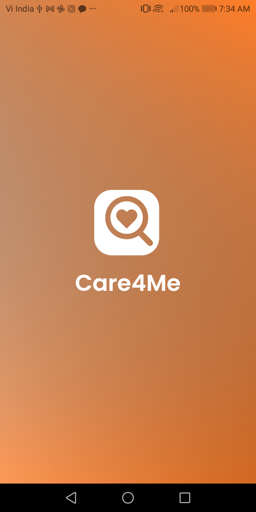
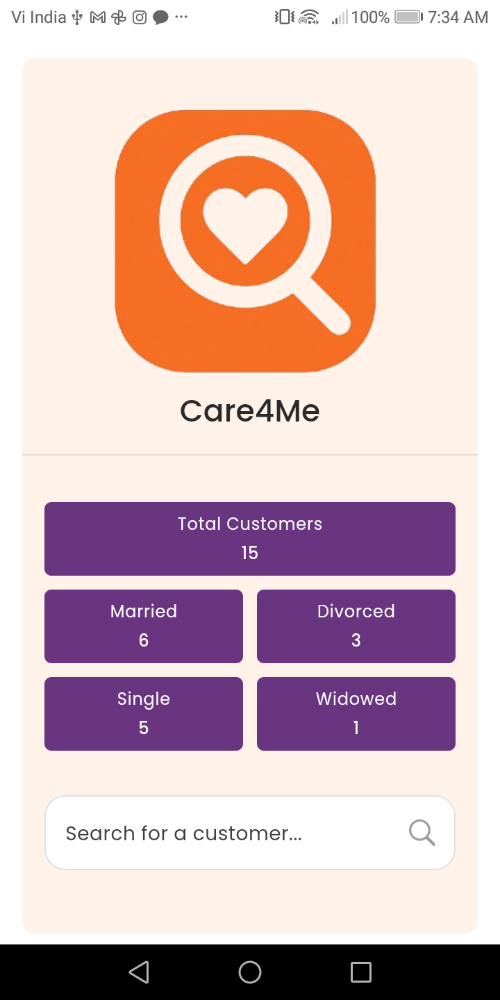
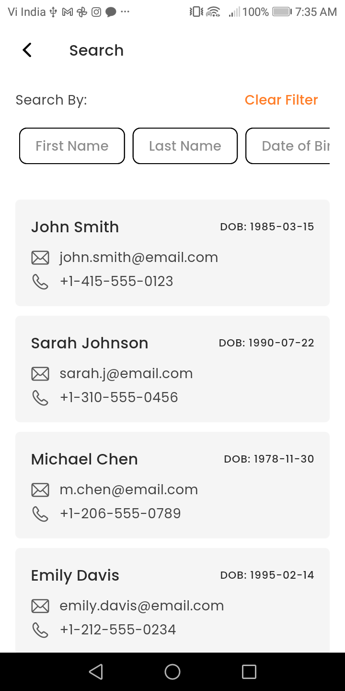
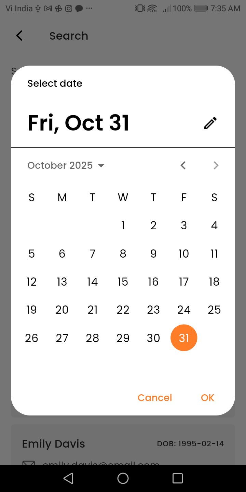
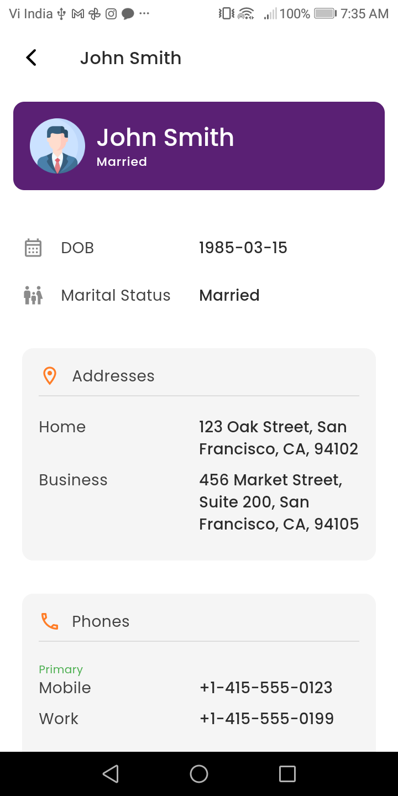

# Care4Me

A Flutter-based customer search application built for the Care247 assignment.  
This app demonstrates a clean **MVVM architecture**, dynamic configuration-driven UI generation, and local filtering with remote API integration for fetching customer data.

---

## 1. Overview

Care4Me allows users to search customers based on multiple fields such as first name, last name, date of birth, city, and more.  
The search system is **configuration-driven**, meaning new search fields can be added without modifying any ViewModel or UI logic.

| Splash Screen | Home Screen | Search Screen |
|----------------|----------------|------------------|
|  |  |  |

| Filter in Search Screen | Details Screen |
|-----------------|--------------|
|  |  |


---

## 2. Tech Stack and Packages

**Framework:** Flutter 3.32.8  
**IDE:** Android Studio & Xcode
**Architecture Pattern:** MVVM (Model-View-ViewModel)

**Core Packages Used:**
```yaml
cupertino_icons: ^1.0.8
google_fonts: ^6.3.2
flutter_riverpod: ^3.0.3
go_router: ^16.3.0
gap: ^3.0.1
dio: ^5.9.0
intl: ^0.20.2
```
---
Why These Packages

> - **Riverpod:** State management and dependency injection for ViewModels and Providers.
> - **Dio:** Network layer abstraction for REST API integration and local JSON server calls.
> - **GoRouter:** Navigation with support for route parameters and typed data passing.
> - **Intl:** Date formatting for consistent yyyy-MM-dd storage and display.
> - **Gap & Cupertino Icons:** Lightweight UI spacing and icon consistency across iOS/Android.
> - **Google Fonts:** Modern typography and consistent cross-platform UI.


## 2. Setup and Run Instructions
**Prerequisites**
Flutter SDK 3.32.8
Android Studio or VS Code
Node.js (for running local JSON server)

**Clone and Install**
```bash
git clone https://github.com/SantlalKaler/careme.git
cd care4me
flutter pub get
```

**Run JSON Server**
```bash
npm install -g json-server
json-server --watch db.json --port 3000
```

**Ensure your API base URL in dio_client.dart matches:**
```arduino
http://localhost:3000
```

**Run App**
For Android:
```bash
flutter run
```

For iOS:
```bash
flutter run -d <your-ios-device>
```

## 4. Configuration-Driven Approach
Instead of hardcoding form fields or filters, all search behavior is driven by configuration.

Example:
```dart
final searchConfig = {
  'firstName': FieldConfig(
    type: 'text',
    label: 'First Name',
    placeholder: 'Enter first name',
    renderOrder: 1,
  ),
  'dateOfBirth': FieldConfig(
    type: 'date',
    label: 'Date of Birth',
    renderOrder: 2,
  ),
  'city': FieldConfig(
    type: 'text',
    label: 'City',
    placeholder: 'Enter city',
    renderOrder: 3,
  ),
};
```

**How It Works**
1. The app dynamically renders ChoiceChips, TextFields, and DatePickers based on the FieldConfig map.
2. User input is stored in a searchValuesProvider.
3. On every change, filters are applied to locally fetched customer data.


## 5. Core Filtering Logic
All filtering happens locally (client-side) for speed and testability.
The code below demonstrates how filters and configuration work together:

```dart
void filterCustomers(
  Map<String, dynamic> filters,
  Map<String, FieldConfig> config,
) {
  final allCustomers = state.customers ?? [];
  if (allCustomers.isEmpty) return;

  final filtered = allCustomers.where((customer) {
    for (final entry in filters.entries) {
      final key = entry.key;
      final filterValue = entry.value?.toString().toLowerCase() ?? '';
      if (filterValue.isEmpty) continue;

      final customerValue =
          _getFieldValue(customer, key)?.toString().toLowerCase() ?? '';

      final fieldType = config[key]?.type ?? 'text';
      final isMatch = fieldType == 'text'
          ? customerValue.contains(filterValue)
          : customerValue == filterValue;

      if (!isMatch) return false;
    }
    return true;
  }).toList();

  state = state.copyWith(filteredCustomers: filtered);
}
```

## Dynamic Field Reader
```dart
dynamic _getFieldValue(Customer customer, String key) {
  final map = customer.toJson();
  if (key.contains('.')) {
    final parts = key.split('.');
    dynamic value = map;
    for (final part in parts) {
      if (value is Map<String, dynamic>) {
        value = value[part];
      } else if (value is List && value.isNotEmpty) {
        value = value.first[part];
      } else {
        return null;
      }
    }
    return value;
  }
  return map[key];
}
```

## 6. How to Add a New Search Field
Adding a new field requires no UI or logic changes.
Simply edit the configuration in search_config.dart:

```dart
'maritalStatus': FieldConfig(
  type: 'text',
  label: 'Marital Status',
  placeholder: 'Enter status',
  renderOrder: 4,
),
```

**Once added:**
> - The new chip will appear automatically.
> -  The form field renders dynamically.
> - The filtering logic adapts instantly.

## 7. Architectural Decisions and Trade-offs

**Pattern: MVVM**
> -  Model: Data classes (Customer, Address, etc.)
> -  ViewModel: State management, filtering, API calls.
> - View: Reactive UI built using Riverpod’s ConsumerWidget and ConsumerState.

**State Management**
> -  Riverpod was chosen for fine-grained reactivity and testability.
> -  Clear separation of UI state (StateNotifier) and data providers.


**Networking**
> -  Dio chosen for structured interceptors, error handling, and scalability.
> - **API calls used for:**
> - Fetching all customers
> - Fetching single customer details
> - Filtering handled locally to minimize API overhead.

**Trade-offs**
> - Local filtering increases memory usage for large datasets but provides instant UX.
> - Config-driven design adds slight complexity but enables long-term flexibility.
> - JSON Server used for simplicity; can easily be replaced by real backend later.


## 8. Platform Notes
**Android**
> - No special configuration required.
> - Tested on Android 15 emulator & on a real device.

**iOS**
> Make sure CocoaPods are updated:
```bash
cd ios
pod install
```
> Run on iOS Simulator:
```bash
flutter run -d "iPhone 15 Pro"
```

## 9. Optional Media

**Include screenshots:**
> - Dynamic chip rendering
> - Search filter working
> - Pull-to-refresh
> - Customer detail view

## 10. Summary
**Care4Me demonstrates:**
> - MVVM pattern with Riverpod
> - Config-driven UI generation
> - Local filtering logic
> - Clean network handling via Dio
> - Dynamic, scalable search system ready for production integration.


